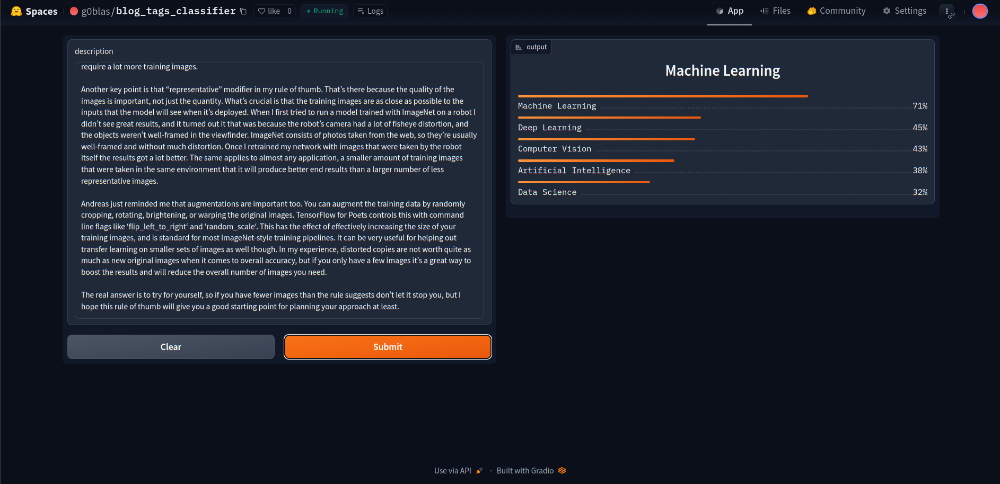
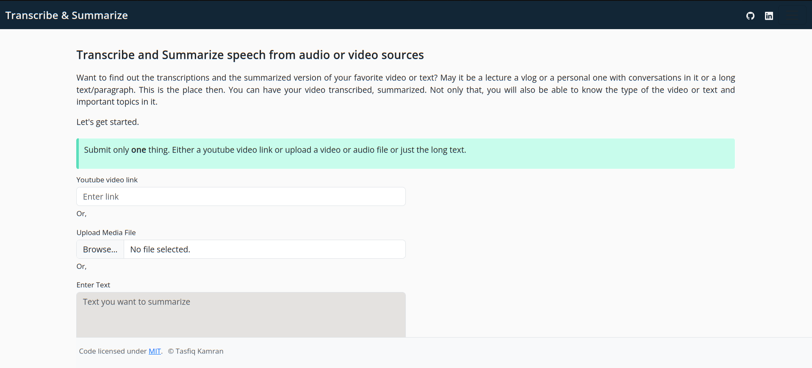
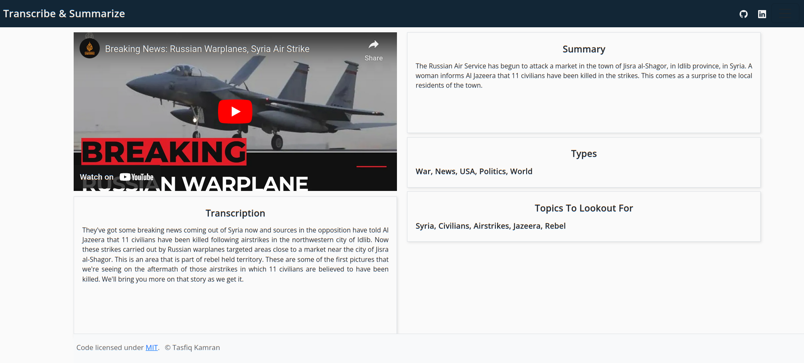

# A Multilabel Text classifier with integrated transcriber and summarizer

<h1 align='center' style=color:#fe5e21;><strong>Just Transcribe and Summaraize</strong></h1>

A multipurpose text classification model transcribes speech from video/audio sources, summarizes, classifies and extracts important topics from the text.  

If you Want to find out the transcriptions and the summarized version of your favorite video or text? May it be a lecture a vlog or a personal one with conversations in it or a long text/paragraph. This is the place then. You can have your video transcribed, summarized. Not only that, you will also be able to know the type of the video or text and important topics in it.

This model can classify **316** different types of tags of the text  The keys of `json_files/tag_types_encoded.json` contains the tags that it can classify.
 

# Data Collection

For training the data were collected from two sources.  
* A kaggle dataset
* From Youtube through scraping.

Data from these sources were merged to create the final dataset which was used for training purpose. Checkout the `csv_files` for the scraped dataset from Youtube. Also, checkout the `csv_files/link.md` to find out about the the dataset from kaggle and the final **merged dataset**.

Data from Youtube were collected through web scraping. `Selenium 4.9.0` was used to do the scraping. Script for the scraping can be found in `scrapers` directory.

# Data Preparation

The data preparation part was very cruical for this project. The dataset from kaggle contains 190K+ data. So scaling down the data was necessary. I took 35% of the whole data and merged with the data scraped from youtube. So, the total size of the dataset became **68275**. 

Data scraped from youtube only contained the links of the video and the corresponding tags. To transcribe the text from the video [WhisperX](https://github.com/m-bain/whisperX) was used. The transcribing part took a lot of time. `notebook/video_transcribing.ipynb` file contains the whole process of video transcribing. `notebook/speech_text_preprocessing` contains the merging of the two datasets. 

# Model Training

For training the model `distilroberta-base` from HuggingFace along with `blurr` and `fastai` were used. The traininig part consists two phases. First, training with freezed layers, then with unfreezed layers. Achieved 99% accuracy after training for 5 epochs. Model training notebook can be found in the `notebook` directory.

## Techincal Details :triangular_ruler:

The training was done in Google Colaboratory environment on a T4 GPU with 15 GB VRAM. At training on freezed layers a learning rate of `3.8e-3` was used which was determined by using fastai's `lr_find` function. The training consists of 2 epochs. Later at unfreezed state more 3 epoch were trained using learning rates between `1.5e-04 to 2.5e-6`. 

### Used Models:
* `distilroberta-base` from huggingface models for training
* `whisperX` for transcribing videos. Checkout [WhisperX](https://github.com/m-bain/whisperX)
* `faster-wshiper` for transcribing audio/video in production. Checkout [Faster-whsiper](https://github.com/guillaumekln/faster-whisper)
* `led-large-book-summary` from huggingface models for summarizing.
* `keyBert` for keyword extraction. Checkout [Keybert](https://github.com/MaartenGr/keyBERT)

 

# Model Compression & ONNX Inference

The trained model has a memory of **317MB**. Compressed this model using ONNX quantization and brought it under **80MB**.

**F1 Scores**

`F1 Score (Micro) = 0.42 `  

`F1 Score (Macro) = 0.32`

# Demos :rocket:
## HF spaces 🤗
A live demo for classifying a blog post or text is at Hugging Face spaces. Check out the live demo [here](https://huggingface.co/spaces/g0blas/blog_tags_classifier?logs=container)  

Used text to produce the result in the demo image can be found [here](https://petewarden.com/2017/12/14/how-many-images-do-you-need-to-train-a-neural-network/)

## Web Deployment
Deployed a Flask App on onrender. Check [`deploy`](https://github.com/Tasfiq-K/just-transcribe-and-summarize/tree/deploy) branch. The website is live [here](https://https://transcribe-and-summarize.onrender.com/)  

Either a video link, a media file (video/audio) or text can be uploaded. which will output the transcriptions, summary of the transcription text, types of the text and important topics extracted from the text. After filling one of the form, click the submit buttion to submit the form.

**Caution**: **UPLOAD ONLY ONE ITEM**

  

The output page might look like this. (Depending on what you upload)

  

The output generated submitting this Youtube [video](https://www.youtube.com/watch?v=yhl7ZasbQW4) to the page.

>**Note**: The output generated from the localhost. As to produce the output it takes a lot of memory, the web app on onrender can't hold that and goes into a out of memory phase, which crashes the webpage.

# Limitations :warning:

* Currently on onrender, It can not provide the result page, where the output would have been shown, because of the memory limit. As the models take up a lot of memory. probably with much memory or using a GPU would solve that problem.
* The classifier can only classifies 316 types of tags. As the dataset was huge, couldn't afford to use more data than that of used to train the model. 
* The Micro and Macro average score is still not that high.

# Future Work :calendar:

* Developing a system, that can run and show result even at a low memory system.
* Using more data to train the model, and trying different model architecture.
* Improving the Macro and Micro average score.
* Implementing own summarizer.

# Contributions :raising_hand:
I'm open for contribution. If you know how to add more to this project, or to take the project to another level, or you know how to optimize the memory problem, you are more than welcome to contribute. The pull request is always open.

